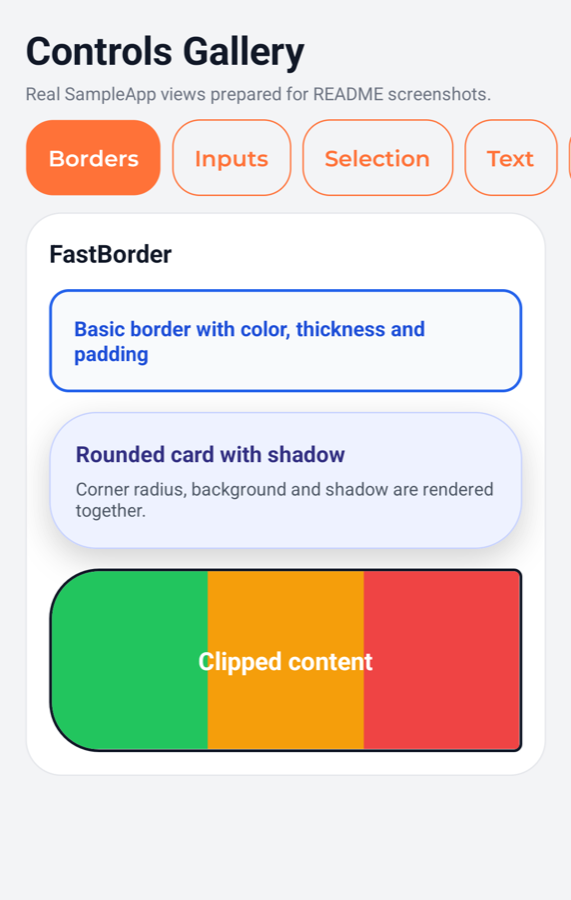
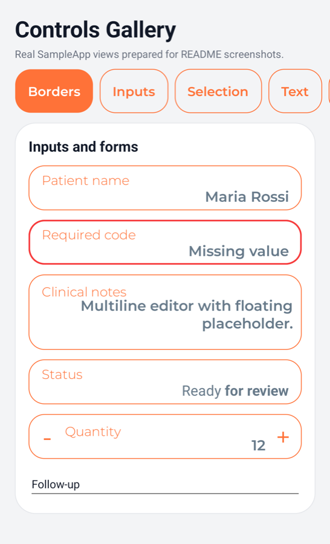
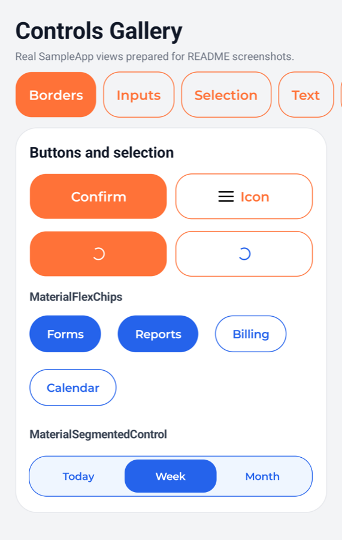
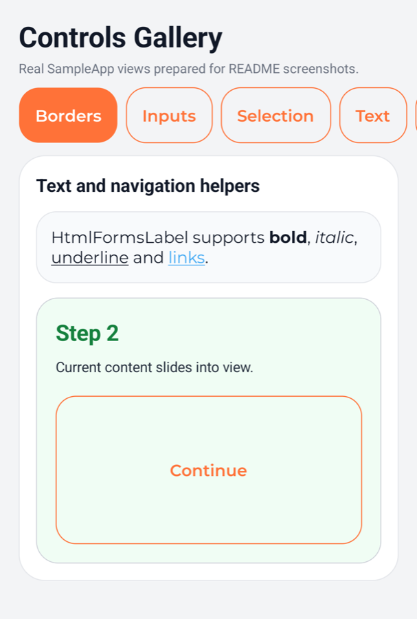
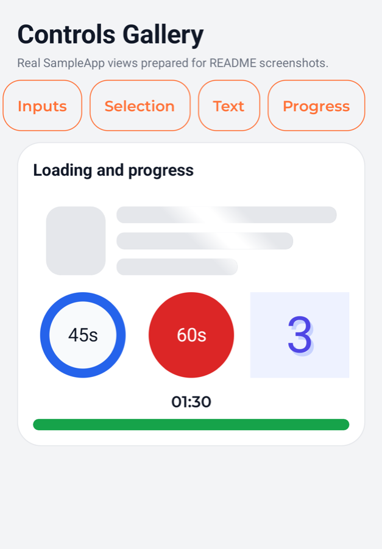

# SevexLabs UI MAUI Controls

Reusable UI controls for .NET MAUI.

## Install

```bash
dotnet add package SevexLabs.Ui.Maui.Controls --version 1.0.0
```

## Register

Register the handlers in `MauiProgram.cs`:

```csharp
using SevexLabs.Ui.Maui.Controls.Extensions;

builder.UseSevexLabsUiControls();
```

## XAML Namespace

```xml
xmlns:controls="clr-namespace:SevexLabs.Ui.Maui.Controls;assembly=SevexLabs.Ui.Maui.Controls"
```

## Gallery

### Borders and containers

FastBorder examples covering borders, rounded cards, shadows and clipped content.



### Inputs and forms

Material input controls for text, multiline notes, read-only values, numeric values and pickers.



### Buttons and selection

Buttons with icon/loading states, chips and segmented selection controls.



### Text and navigation helpers

HTML-formatted text and slide-based step content.



### Loading and progress

Loading placeholders, countdown controls and media progress.



## FastBorder API

`FastBorder` is a lightweight alternative to MAUI `Border`, but it does not use
the same border property names. Use `BorderColor`, `BorderThickness`, and
`CornerRadius`.

Do not use MAUI `Border` properties such as `Stroke`, `StrokeThickness`, or
`StrokeShape` with `FastBorder`.

```xml
<controls:FastBorder
    BorderColor="#4F46E5"
    BorderThickness="1"
    CornerRadius="12"
    Padding="16">
    <Label Text="Native-rendered FastBorder" />
</controls:FastBorder>
```

## Included Controls

- `FastBorder`
- `BorderlessEntry`
- `BorderlessEditor`
- `MaterialButton`
- `MaterialDisplayField`
- `MaterialEditor`
- `MaterialEntry`
- `MaterialFlexChip`
- `MaterialFlexChips`
- `MaterialNumericEntry`
- `MaterialPicker`
- `MaterialScrollView`
- `MaterialSegment`
- `MaterialSegmentedControl`
- `HtmlFormsLabel`
- `MediaProgressBar`
- `ShimmerLayout`
- `ShimmerView`
- `SlideStepsView`
- `Countdown controls`
